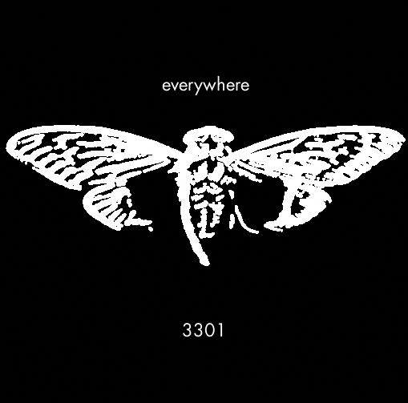

# 845145127.com

The website had three different phases.

## Server info

Known services under domain:
- SSH
- HTTP
- FTP
- XMPP

>Hey, just noticed that they're running XMPP client and S2S servers on that site. Oh, and ssh and ftp (neither of which have banners; I checked). I'm trying to get a client working to see if I can get an in-band registration. If I can get registered, what should I do? 

>\>\>4230234 here
>
>Got pidgin up and running and the server at 845145127.com appears to be moderately well behaved until it abrutly terminates the connection with a `<stream:error>Disconnected</stream:error></stream:stream>` as soon as I give it a (guessed) username. I suppose we're SOL on this one for now unless I can convince pidgin to attempt to in-band register without dying on the initial connect. 

[source](https://warosu.org/sci/thread/4229423#p4230234)

### DNS

View record here: https://completedns.com/dns-history/?domain=845145127.com

Dream Host was used as the hosting provider in 2012.

```
ns1.dreamhost.com
ns2.dreamhost.com
ns3.dreamhost.com
```

## Countdown

The site initially presented with a countdown to January 9, 2012 at 5PM UTC.

View [countdown](./countdown/) for an archive/recreation of site in this state.

The cicada image from this state:


Outguess message within image:

```
-----BEGIN PGP SIGNED MESSAGE-----
Hash: SHA1

You have done well to come this far.

Patience is a virtue.

Check back at 17:00 on Monday, 9 January 2012 UTC.

3301
-----BEGIN PGP SIGNATURE-----
Version: GnuPG v1.4.11 (GNU/Linux)

iQIcBAEBAgAGBQJPCKDUAAoJEBgfAeV6NQkPf9kP/19tbTFEy+ol/vaSJ97A549+
E713DyFAuxJMh2AY2y5ksiqDRJdACBdvVNJqlaKHKTfihiYW75VHb+RuAbMhM2nN
C78eh+xd6c4UCwpQ9vSU4i1Jzn6+T74pMKkhyssaHhQWfPs8K7eKQxOJzSjpDFCS
FG7oHx6doPEk/xgLaJRCt/IJjNCZ9l2kYinmOm7c0QdRqJ+VbV7Px41tP1dITQIH
/+JnETExUzWbE9fMf/eJl/zACF+gYii7d9ZdU8RHGi14jA2pRjc7SQArwqJOIyKQ
IFrW7zuicCYYT/GDmVSyILM03VXkNyAMBhG90edm17sxliyS0pA06MeOCjhDGUIw
QzBwsSZQJUsMJcXEUOpHPWrduP/zN5qHp/uUNNGj3vxLrnB+wcjhF8ZOiDF6zk7+
ZVkdjk8dAYQr62EsEpfxMT2dv5bJ0YBaQGZHyjTEYnkiukZiDfExQZM2/uqhYOj3
yK0J+kJNt7QvZQM2enMV7jbaLTfU3VZGqJ6TSPqsfeiuGyxtlGLgJvd6kmiZkBB8
Jj0Rgx/h9Tc4m9xnVQanaPqbGQN4vZF3kOp/jAN5YjsRfCDb7iGvuEcFh4oRgpaB
3D2/+Qo9i3+CdAq1LMeM4WgCcYj2K5mtL0QhpNoeJ/s0KzwnXA+mxBKoZ0S8dUX/
ZXCkbOLoMWCUfqBn8QkQ
=zn1y
-----END PGP SIGNATURE-----
```

## Locations

Upon countdown completion on January 9, 2012 at 5PM UTC, the website was updated with a list of locations and a new image (PGP signed version of website contents missing two locations).

The two missing locations in the signed message are:

```
37.577070, 	126.813122 
36.0665472222222, 	-94.1726416666667 
```

View [locations](./locations/) for an archive/recreation of site in this state.


Outguess message within image:

```
-----BEGIN PGP SIGNED MESSAGE-----
Hash: SHA1

52.216802, 21.018334  
48.85057059876962, 2.406892329454422 
48.85030144151387,2.407538741827011  
47.664196,  -122.313301 
47.637520, -122.346277 
47.622993, -122.312576 
37.5196666666667, 126.995 
33.966808, -117.650488 
29.909098706850486 -89.99312818050384 
25.684702, -80.441289 
21.584069, -158.104211 
- -33.90281, 151.18421 
3301
-----BEGIN PGP SIGNATURE-----
Version: GnuPG v1.4.11 (GNU/Linux)

iQIcBAEBAgAGBQJPChn7AAoJEBgfAeV6NQkPZxMP/05D9TkSpwRaBXPqYthuyqxx
uo+ZDyr/yVIlAdurTBiWb3aGxKJjtWg/vlcHcatK0TGL2qaHwB/FFZQAaqOyU7Zf
DXdpWr8PWoWhpWNYUK8IrOaYu1SmWlJnkTdUSzGrX0lbwjwMmJJoPNS7CJuO6MaA
2GIwpv2G7lYqnH3xeX3kzGlPMsVb/wucKRjobsbdbreh1SNuQuRnhfe4s+oHTTqs
XjtGL/VhBI0DUAdfLqW7z4C+Gvbx6okC8x5Sj2N2UTJOiyMYXz5+QyHoA6fo9g5V
6zodNpx/RvxuZP2Ssc9TqERgTo5FjRBpON1vjDalHgg0H2Fus2LK3gh+NZfj1i5b
Oqa4Cqd9epI2pe+glXn86j9crS+2BEAr1cguqAFepvI9sdFEornDja4VXwDtUdM8
9hMVkU5NiTUYfvxZbL6W7rHIF7wxjGUwpe1ViuixG+cKNfv0enrt60PrtDByBOWI
9LLIUE0cB5HDT1xrczZ/55CtuM3Zf07/l0nLFdmgR0oa8KUA9gWcPs6S1EpBa185
VcyOTqbpIPiT8neiJEkXarbJeFk15m1P73Fr8XZxdj7EHK0aOwGYcc8e4PmW/dSh
gcrSNXiePCbcRVRD2n9L47C0LkNyRpoBkmjvtpcRyp5ISe+0xcx/QI+gc1lkSijC
89qV+ymCHae1RiSDxVbd
=ZJ37
-----END PGP SIGNATURE-----
```

The locations:

- Oleandrów 6, 01-001 Warsaw, Poland
- 89-91 Rue de la Plaine, 75020 Paris, France
- 36 Rue des Maraîchers, 75020 Paris, France
- 4739 University Way NE, Seattle, WA 98105, USA
- 514 Crockett St, Seattle, WA 98109, USA
- 428 15th Ave E, Seattle, WA 98112, USA
- South Korea, Seoul, Gangseo-gu, Banghwa-dong, 830-8
- South Korea, Seoul, Yongsan-gu, Seobinggo-dong, 287-1
- 853-899 W Dickson St, University of Arkansas, Fayetteville, AR 72701, USA
- 15717-15735 Euclid Ave, Chino, CA 91708, USA
- State Highway 407, New Orleans, LA 70131, USA
- 8718-8798 SW 152nd Ave, Miami, FL 33193, USA
- 66-420 Kamehameha Hwy, Haleiwa, HI 96712, USA
- 143 George St, Erskineville NSW 2043, Australia

Found posters


These QR codes lead to image URLs on the domain (ex: `http://845145127.com/<num>.jpg`), the whitespace message reveals the same numbers of the JPGs.

## Whitespace (second chance)

On January 12th, the website changed to whitespace. It was binary encoded as tabs and spaces which yielded a PGP signed message. See [extract-binary.py](./whitespace/extract-binary.py) for decoding. 
It yielded the following message:

```
-----BEGIN PGP SIGNED MESSAGE-----
Hash: SHA1

162667212858 
414974253863
598852142735
876873892385
935691396441
316744223127
427566844663
644169769482
889296759263
963846244281
-----BEGIN PGP SIGNATURE-----
Version: GnuPG v1.4.11 (GNU/Linux)

iQIcBAEBAgAGBQJPDRkvAAoJEBgfAeV6NQkPVuMP/3ZyAgwsko/B2T9Ew1yqAKVy
K9//wIWCRvMyZ4k79ApqvOJAlezgHTsAM8XG/I71bAG+2wMOXNJfTj/SFONEEbS5
BOp9UP7LHn1j3NKoESrDzsKd+u3oHoNnhs628aLrc8uDqbn/6DNUnObu5Tn3unu0
zZ3NjSs/A5QQX8O56RsK81eSJ2fifbr4NYfHBeUTeVe17nsr48WQI7qc9UVWlPsM
91FWsvhX+WohX8DyFWJmtz0lLvmh3jN+oE8WFPTVbcVCM+eiDt0TqkUNlmq/fxbd
X2Sbs8zMxDXNQWrw58TcSC6oLfXSXZnjh8uTMwrQ0tNdRXHDndgPiurXz62XjVjf
4AhSXBoXF9CHTOyGGEqvfNvFMKyz968iMZDXDNBrM8pkxx1xBHhAnoEznVpeMhII
+IfBTnV8x9lSNgFhmham5eEZlWvqRidqes8EAriqGA6uZokCq7X1IeMHo52ACWmP
2bJsCV5wZDc52c3JnwKe+cAcbsA4OWCNEH29lAsgFw5079BP8lkpY3AH2+8kqs0X
QvqsaMuUq5ZHEaZMgdD0VKYlRrKdhOiDjtJVxoXk1b7YBOV8dZZBXJbEIbTvaof4
yhgUObovx/VFGmsenp+j3nBCxgEO22SgNW3B3pN0yuIMCqccWEZ1nME/QOwLa85n
HOmElIXvK13Q9m545RtP
=Q1Fy
-----END PGP SIGNATURE-----
```

These numbers were JPGs that could be found by appending `/<num>.jpg` to the domains URL. Of these, I have two images. The first is the same found in Sydney, Australia.



Outguess message:

```
-----BEGIN PGP SIGNED MESSAGE-----
Hash: SHA1

In twenty-nine volumes, knowledge was once contained.
How many lines of the code remained when the Mabinogion paused?
Go that far in from the beginning and find my first name.

1:29
6:46
the product of the first two primes
2:37
14:41
17:3
27:40
the first prime
2:33
1:1
7:45
17:29
21:31
12:17
the product of the first two primes
22:42
15:18
24:33
27:46
12:29
25:66
7:47

You've shared too much to this point.  We want the best,  
not the followers.  Thus, the first few there will receive 
the prize.

Good luck.

3301
-----BEGIN PGP SIGNATURE-----
Version: GnuPG v1.4.11 (GNU/Linux)

iQIcBAEBAgAGBQJPB1luAAoJEBgfAeV6NQkP9oAP+gLu+FsRDf3aRcJtBkCOU2MX
r/dagOTvCKWtuV+fedy0enWUZ+CbUjXOr98m9eq2z4iEGqKd3/MBXa+DM9f6YGUE
jPum4wHtQDSJlZMazuYqJOVZGw5XmF25+9mRM6fe3H9RCiNDZpuXl3MzwdivYhcG
B5hW14PcdHHteQf3eAUz+p+s06RDs+q1sNGa/rMQIx9QRe71EJwLMMkMfs81kfJC
tCt21+8ud0Xup4tjUBwul7QCcH9bqKG7cnR1XWsDgdFP6a4x9Jl2/IUvp1cfeT7B
YLS9W3lCM8thMemJr+ztQPZrpDlaLIitAT2L0B3f/k4co89v5X2I/toY8Z3Cdvoi
hk0AdWzMy/XLDgkPnpEef/aFmnls53mqqe9xKAUQPMrI73hiJ+5UZWuJdzCpvt+F
BjfQk15EJoUUW16K2+mBA1cSd+HJlnkslUTsjkq0E36XKChP+Cvbu/p6DLUMM2Xl
+n3iospCkkHR9QDcHzE4Rxg9A435yHqqJ/sL2MXG/CY8X4ec6U0/+UCIF9spuv8Y
7w66D05pI2u9M/081L7Br0i0Mpdf9fDblO/6GksskccaPkMQ3MRtsL+p9o6Dnbir
6Z2wH2Kw1Bf0Gfx4VcpHBikoWJ5blCc6tfvT+qXjVOZjWAL7DvReavSEmW1/fubN
C3RWcjeI4QET2oKmV2NK
=LWeJ
-----END PGP SIGNATURE-----
```

The second, is `everywhere.jpg`.


Outguess message:

```
-----BEGIN PGP SIGNED MESSAGE-----
Hash: SHA1

A poem of fading death, named for a king
Meant to be read only once and vanish
Alas, it could not remain unseen.

1:5
152:24
the product of the first two primes
14:13
7:36
12:10
7:16
24:3
271:22
10:7
13:28
12:7
86:17
93:14
the product of the first two primes
16:7
96:4
19:13
47:2
71:22
75:9
77:4

You've shared too much to this point.  We want the best,  
not the followers.  Thus, the first few there will receive 
the prize.

Good luck.

3301
-----BEGIN PGP SIGNATURE-----
Version: GnuPG v1.4.11 (GNU/Linux)

iQIcBAEBAgAGBQJPB/nmAAoJEBgfAeV6NQkPEnEQAKl5qtb3ZE5vs+c08KuzAi4a
tQEE71fvb65KQcX+PP5nHKGoLd0sQrZJw1c4VpMEgg9V27LSFQQ+3jSSyan7aIIg
SDqhmuAcliKwf5ELvHM3TQdyNb/OnL3R6UvavhfqdQwBXCDC9F0lwrPBu52MJqkA
ns93Q3zxec7kTrwKE6Gs3TDzjlu39YklwqzYcUSEusVzD07OVzhIEimsOVY+mW/C
X87vgXSlkQ69uN1XAZYp2ps8zl4LxoaBl5aVtIOA+T8ap439tTBToov19nOerusB
6VHS192m5NotfQLnuVT4EITfloTWYD6X7RfqspGt1ftb1q6Ub8Wt6qCIo6eqb9xm
q2uVzbRWu05b0izAXkHuqkHWV3vwuSfK7cZQryYA7pUnakhlpCHo3sjIkh1FPfDc
xRjWfnou7TevkmDqkfSxwHwP5IKo3r5KB87c7i0/tOPuQTqWRwCwcWOWMNOS7ivY
KQkoEYNmqD2Yz3Esymjt46M3rAuazxk/gGYUmgHImgcu1zzK7Aq/IozXI7EFdNdu
3EoRJ/UL9Y0l0/PJOG5urdeeTyE0b8bwgfC2Nk/c8ebaTkFbOnzXdAvKHB03KEeU
PtM6d6DngL/LnUPFhmSW7K0REMKv62h9KyP/sw5QHTNh7Pz+C63OO3BsFw+ZBdXL
hGqP6XptyZBsKvz2TLoX
=aXFt
-----END PGP SIGNATURE-----
```