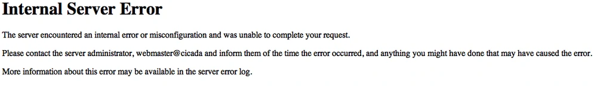

# RSA E-mails

After submitting their email to `sq6wmgv2zcsrix6t.onion`, players received an email from `c99194853094755497@gmail.com` containing a number, following Cicada's instructions they visited `sq6wmgv2zcsrix6t.onion/NUM`. It was served only once per number.

## Challenge

There are several versions of this I was able to find, below is the only one with a valid PGP signature from Cicada due to redactions in the others.

See [quaetrix0@gmail.com.asc](quaetrix0@gmail.com.asc). [source](https://web.archive.org/web/20121231040539/http://pastebin.com/4YaQ0TvJ)

```
-----BEGIN PGP SIGNED MESSAGE-----
Hash: SHA1


This message will only be displayed once.

Here is a message that has been encrypted with RSA (the Crypt::RSA Perl module available in CPAN) :

- -----BEGIN COMPRESSED RSA ENCRYPTED MESSAGE-----
Version: 1.99
Scheme: Crypt::RSA::ES::OAEP

eJwBzQAy/zEwADE4OABDeXBoZXJ0ZXh0Ca4y//uzl/HvFoP9Klf53nEFH0T4c+ui5de8+vqGOnZc
9DlrsWQe+xxVaPaYgKAD9Wn9VWQ6A5o254r5pa4hkDIY5RRmVfqOm88HJpGdbGGTckyEwJapCLDT
tHzZWAZ0FIVj6fH2whErHoVmZ82zQJ64OLtzr1gYk+2kIZuqtLclV9RDhs6j7meTaod2BDrF26tY
d33awv0txxrgXRhd/FDFVtKb0K84cQs2xtO/9A0yLs5GEK2xpG2yM4AeWWft
=I1r6Wtzf/29vTggAK+ELEA==
- -----END COMPRESSED RSA ENCRYPTED MESSAGE-----


Here is the public key used to encrypt it. Note that it has a low bit modulus and is therefore breakable:

$VAR1 = bless( {
                 'e' => 65537,
                 'n' => '7880891639791153779530258464649693928733411681581577103690292822333198036864739065916344030512697162068582555837',
                 'Version' => '1.99',
                 'Identity' => '<quaetrix0@gmail.com>'
               }, 'Crypt::RSA::Key::Public' );


The encrypted message is a number.  Break the decryption key, then come back to this same URL and enter the 
decrypted message to continue.  Each person who has come this far has received a unique message encrypted 
with a unique key.  You are not to collaborate.  Sharing your message or key will result in not receiving 
the next step.

There is a second chance to get your own RSA message and key.  Follow the "Numbers dot TK" hint to find it.

There are many fake messages out there.  Only messages signed with public key ID 7A35090F are valid.  

Good luck.

3301 

-----BEGIN PGP SIGNATURE-----
Version: GnuPG v1.4.11 (GNU/Linux)

iQIcBAEBAgAGBQJPEi5eAAoJEBgfAeV6NQkPuiMP/27jZQ7t27p8cg8R8//Cj4Sf
RWVF09jFYtAZ9S38atQy2bFlkBYRejQu49iZa2mGp2ITa2zfsbI3NviOeY3XJXRy
9zxzNIF6IkPm6dCwRARTsXGYz4/9I6AgyLT6OyT1ltzys+c2kccGJ+2XXo9VNpA5
D8EoWRWAaiIJhF9ezLK/j2ImaDJnQ/y2PnjVm+QE4ywivp6arSoAbxwOga6TIef4
uwjw9PKMkHR+9nJOvKSkG9S9FKxMhSo9r0jr7AVLmls8Q30t2fJ6wDNI+ygWBljo
JIvu+Av6ACmhktO6XMW3xNe2TG3W7WnhrmERm+DgzOWkfCRa2lAd42CPiwTgVI5x
1tIPowTpW0HvZlqT2/wxKmSEs994MJkPzHI+82GkXxv3FbWms/ztdBuMcv7+sUbT
IS2549fOw51S2zLvZ1RoSaKIQGZd9ycGMOPQs8etxgOWtK34tOdZlntpDQHyTDqj
NX+0/Aer7pFmtVE92iYBLlDIHH9xZnNkN6ZZSC+oXl9SP6ivs535qyYDTuM/IfFc
6zNlhuVOqosIbRp51EhWLG0vhOtNDMUTaPaQk7t5dnm6SmYjLcv5xc6qyo/3Xu2F
vCvmA0zgTaYbtWD6NI+ejTjGhZ8Pk+WeVxSyJ0Io9Q5S90/hxdAegtAVGUnLhxYa
vbacP/zEyYKHfIdkNn9R
=LMdX
-----END PGP SIGNATURE-----
```

### Factoring

In order to solve this challenge, `n` must be factored into its two primes `p` and `q`. 

This may be done in one of several ways, but depends on the distance between `p` and `q`. The first method (and one commonly used with participants) is a general number field sieve (GNFS). A second potential candidate is fermat factorization, although I have not personally attempted it. If the primes are close to one another, this is another way to factor within a lifetime - and possibly much quicker than sieving.

Reference [factor.sh](factor.sh) (pass the script `n`, it will take ~1 hour on modern hardware) for factoring method used. Personally, I used cado-nfs as msieve is dated and certain components don't compile well against modern hardware. Have fun attempting to get CUDA to run if you choose this path.

After factorization is complete, you are presented with the following `p` and `q` (see [quaetrix0@gmail.com.factors](./quaetrix0%40gmail.com.factors)):

```
98007492061325958997349177934627388613835953553459586261 80411114232571782218163489375797613948878398942588985417
```

### Key reconstruction/decryption

In order to retrieve the message from the compressed RSA method, the private key needs to be recreated. Now that we have `p` and `q`, we can use the same `Crypt::RSA` module to do the heavy lifting (no need to compute inverse-mod, etc.).

First, there is some prep-work. We need to isolate the RSA encrypted message from the rest of the PGP-signed message. This involves removing the prepended `- ` from the armor. See [quaetrix0@gmail.com.pem](./quaetrix0%40gmail.com.pem) for reference.

See [recreate-pk-decrypt.pl](recreate-pk-decrypt.pl) for reference. It takes 4 arguments: `p`, `q`, identity for naming output file, and the RSA encrypted message. See example usage below.

`./recreate-pk-decrypt.pl 98007492061325958997349177934627388613835953553459586261 80411114232571782218163489375797613948878398942588985417 quaetrix0@gmail.com "$(cat quaetrix0@gmail.com.pem)"`

This will recreate the key (see [quaetrix0@gmail.com.private](quaetrix0@gmail.com.private)), it will look like the following:

```
$VAR1 = bless( {
                 'Checked' => 1,
                 'private' => {
                                '_dq' => '62101227333680030901477437955149311570693368388546911025',
                                '_phi' => '7880891639791153779530258464649693928733411681581577103511874216039300295649226398605919027949982809572533984160',
                                '_u' => '4348205097514343307003508663178692051409656423708745886',
                                '_n' => '7880891639791153779530258464649693928733411681581577103690292822333198036864739065916344030512697162068582555837',
                                '_d' => '3539228264069658941348163131232277823374304173402947606856607442001749947381601711457183100090390070514958271233',
                                '_e' => '65537',
                                '_p' => '98007492061325958997349177934627388613835953553459586261',
                                '_q' => '80411114232571782218163489375797613948878398942588985417',
                                '_dp' => '32650221617939937177306324699737854579945380074350109813'
                              },
                 'Version' => '1.99',
                 'Cipher' => 'Blowfish'
               }, 'Crypt::RSA::Key::Private' );
```
Upon successful decryption after the script runs, you should now have the following plaintext: `33521494043430258676`.

### Solves for other known `n`

Just like the `quaetrix0@gmail.com` solve above, this directory contains all instances of these RSA challenges I was able to find. You may run them all by using [decrypt.sh](decrypt.sh). 

All intermediate files created in the solve above can also be found in this directory for each of the unknown identities. Their plaintexts are the following: `29201928111913239376` and `25121996842107342310`. 

Due to redaction of these emails, the Cicada signature will report bad when verified. For that reason - the above solve is the one listed. It's contents can be verified via signature.

**Unknown**

- `n = 5871616005012744251113781121559847071824350263409014769234326809362840408459053493071501259089516974751495136587`
- plaintext: `29201928111913239376`
- [source](https://web.archive.org/web/20120116170758/https://pastebin.com/HakCdFW1)

- [unknown email](unknown.asc)
- [unknown factors](unknown.factors) 
- [unknown private key](unknown.private)
- [unknown encrypted RSA message](unknown.pem)

**Another unknown**

- `n = 7467492769579356967270197440403790283193525917787433197231759008957255433116469460882489015469125000179524189783`
- plaintext: `25121996842107342310`
- source: Lots of places, including Nox's video.

- [another unknown email](another_unknown.asc)
- [another unknown factors](another_unknown.factors)
- [another unknown private key](another_unknown.private)
- [another unknown encrypted RSA message](another_unknown.pem)

## Shared information

For found, publicly shared keys - the ownere was emailed the following message. See [shared.asc](shared.asc)

```
-----BEGIN PGP SIGNED MESSAGE-----
Hash: SHA1


Hello.  You have shared your information online.  You are now removed from this altogether.
Even if you crack the key you've been given it doesn't matter, because you have demonstrated
that you can't be trusted to follow simple instructions anyway.

Thank you for your participation to this point.

Goodbye.

3301
-----BEGIN PGP SIGNATURE-----
Version: GnuPG v1.4.11 (GNU/Linux)

iQIcBAEBAgAGBQJPEsO0AAoJEBgfAeV6NQkPJRUP/1JyxwilMLUX0J+2gLofZV/C
/eIJkO3lxYuLQQWiouJVzBSddZ/GVP2XLP86OaZpYoChzGRxYaIia62e0ZnRQHei
d7UNWvOjenveo7QUpxpY+xPvPq41l/JJAntE6H82yO4NlCTTFi7UJBG2r8EgSc/s
gQs1A5TANcJgq8mFoscPH4T1QxT5N0AXbALMNyEUS37UqBcV40/7v9AJq52tyLnQ
IInxdmY38RO/sJJIAi/4hCquJ6OYFYmQxBTldKhacEE0/e8BQXIm/eIXClPL3ff0
mET9uP8CwyFQW8nUM7dBRO4CKTUJ0cYxjj3PlHnRUdfM7AyywWeXkqwlDB4OFOy2
Jw9/18phYSxTV2cM6ETRBK1xSGwevHHBaEdJF7xZAIA3EYbqyjW09YQnf4dihEg7
O3faR8docXTPwQ0qhuU65krI5O17N3Sn731RvBz9bZcDm+E8nh0m6wA0yRBYYjYo
8SW5MscEN2SI7xq8lskHdX9uogDVnb9IqTV2YfrQplnpZIR5jfLU+uWgVXMA2faQ
i9QMtyvKGGZ6ejPX+euPmp8XRIUHeXD5H/YQSTTy6D/0WnMHpH/h9p1FRcWOZSbR
1Gmmxi/Oix4PtBXjuNJt51KuQxVsh3s1f2KTcVV3tILalYtyPtoqTRST05KwV/Jj
GnHprhtOWRq4pAHlQktc
=kPlo
-----END PGP SIGNATURE-----
```

### Submission

When the RSA encrypted message was broken, solvers headed back to the same number URL and submitted the message. Initially, it resulted in a 500 error.



On the 17th of January around 2:49 UTC, it succeeded.

```
Correct. We’ll email you.
```