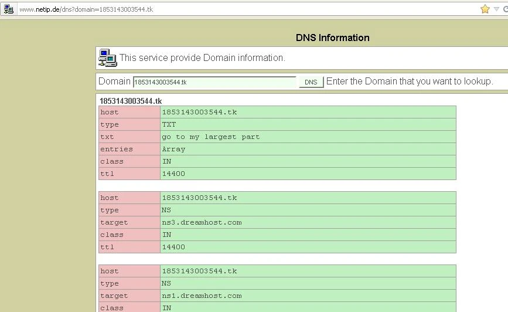
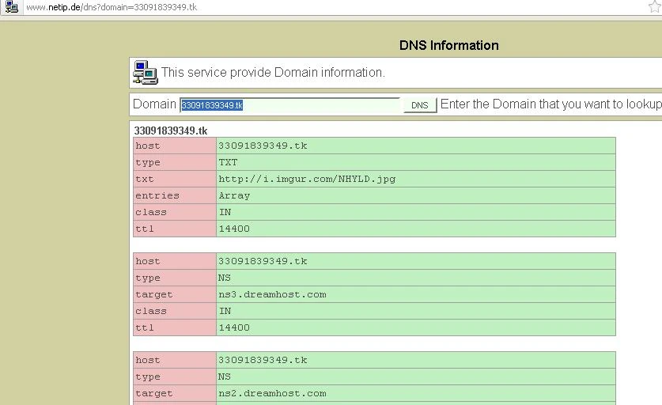

# Second chance

Using the decoded message from the [whitespace update to 845145127.COM](../005-845145127.com/README.md#whitespace-second-chance) (also the names of the images found on QR code posters), users were able to arrive at a `.tk` domain. `1853143003544.tk` was anonymously posted in IRC; however, this can be arrived at by separating the numbers in the [whitespace message](../005-845145127.com/whitespace/whitespace.asc) (also, the numbers of the images found in QR code scans from dead-drops) into groupings of Agrippa-related and Encyclopedia Brittanica related. 

A script of obtaining the numbers for the `.tk`s is located at [numbersdottk.py](numbersdottk.py) for a TLDR.

## 1853143003544.tk

**Agrippa**
```
644169769482
876873892385
935691396441
963846244281 <-- Largest
```

**Encyclopedia Britannica**
```
162667212858
414974253863
598852142735
316744223127
427566844663
889296759263 <-- Largest
```

Take the largest from either group and sum them, arriving at `1853143003544` (Numbers) "dot TK".

Within this domain, there was a DNS TXT record with simply "Go to my largest part". Whether a webpage actually existed here is currently unknown. If you have an archive of it or logs of scans, etc.; feel free to create a pull request. Here's a mock `nslookup` to represent this DNS record.



## 33091839349.tk

*Go to my largest part* is referring to the largest prime number of `1853143003544`. Factoring and adding
a `.tk` will give us the next domain.

```
$ factor 1853143003544
1853143003544: 2 2 2 7 33091839349
```

Historical DNS shows a TXT record for the image URL at `http://i.imgur.com/NHYLD.jpg`. Some solvers state they were presented with a black background and the photo at the imgur link.



If it was an HTML page, I recreated it using what we know/common simplicity of formatting from other pages [here](33091839349.tk/) (following suit for the `.com` with the title).

### Image

The image was "The Lady of Shallott" by John William Waterhouse. (word-play since we are now in onionland? mayhaps)


Running outguess on the image reveals another PGP-signed message from Cicada.

```
-----BEGIN PGP SIGNED MESSAGE-----
Hash: SHA1

Miss round 1?  
Care for a second chance?
http://i.imgur.com/hkdgl.png
1:22
3:33
3:40
6:19
4:7
4:8
4:7
9:23
12:12
4:16
16:7
11:16
1:7
5:14
3:35
2:2
4:26
1:12
3:11
3:28
4:23
18:18

Good luck.
3301
-----BEGIN PGP SIGNATURE-----
Version: GnuPG v1.4.11 (GNU/Linux)

iQIcBAEBAgAGBQJPDTiqAAoJEBgfAeV6NQkPytAP/1UQeylwYBjQWuzr8pbERN04
wlZVCG5SjGanqfQKxSa5Z8YOVR9LRlT6sHBKgfOEDztj+6RM2SvX7Y2Mw9mA4g90
7bizXi8IkP5K3tMvNxcA6uEy0rSchJt4D93zzjPvS7lm6jGO1gJQXrwMUd4fACs1
hxZ3Cxva0MIS+r8MxRJbU/mKbDvnEr6fwUaB6m1vFgYW6wTM4qS2ES04ic+mlkbR
0/eRPnFIBb06XjQpijDAGiisgVORaUUrUJGX+Wnp61CVobBmKwUdw3n0AxbKRC3/
Nja0HYvXexWDiRgxE2YjZyq0Pk4TnZoXxTnyS6NKZ1i1Qxysu4xUfuLO3L6zrnQP
TT4EsqDxzMAKQuJS6qo/pLsdCqyXO1Jr4wIlaG5AGYKMjt9k61Y12WLiqhpLTgzd
AtUTejZzThXqbhmm4wPCVk+Vsik8PLs/Ts6DooB3Ki3AtRtldmeCXdo+mid3Og+A
IKw9+KtB2JDd4a6DbsNbRDIt1pZmyPA3xmmksc8ogx/CEPATPwL7JaN5UwVNSZKM
6MiJ1+b39Kx9ckQ8vSuYa5cALDiUwZPddopl29zbVmKciW+sDGfSiSroXw7khNJs
dzmJ4hR2R7Bbv23Ngxt/M/J5/udOd0AaeDKMxfLNnaLqm8FiaWqnL5TwkzMFnad7
RKpOZq9TkllIE6NBB4wc
=mGcB
-----END PGP SIGNATURE-----
```

## Image and book code

The URL provided in the outguess message provided the following image. It is a clipping of [William Blake's *The Marriage of Heaven and Hell*](https://web.archive.org/web/20051215135546/http://www.gailgastfield.com/mhh/mhh4.jpg).


This hints at using the text from the book this is in. Using the page this image is referenced in, format the text as it appears in the image for the full page of *The voice of the devil*. (See [the-marriage-of-heaven-and-hell.txt](the-marriage-of-heaven-and-hell-formatted.txt)). It can now be decoded with the script in [book-code.py](book-code.py), resulting in `cginiziglyaobyph.onion`.

From here, users received the same message as seen in [the original onion](../007-onions/README.md#sq6wmgv2zcsrix6tonion). Continue there.

## References

* [*The Marriage of Heaven and Hell* by William Blake](https://web.archive.org/web/20121209190125/http://www.gailgastfield.com/mhh/mhh.html)