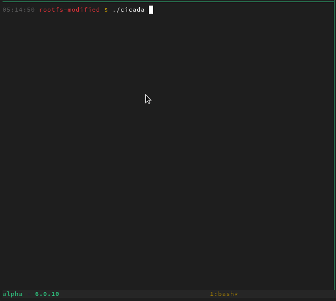
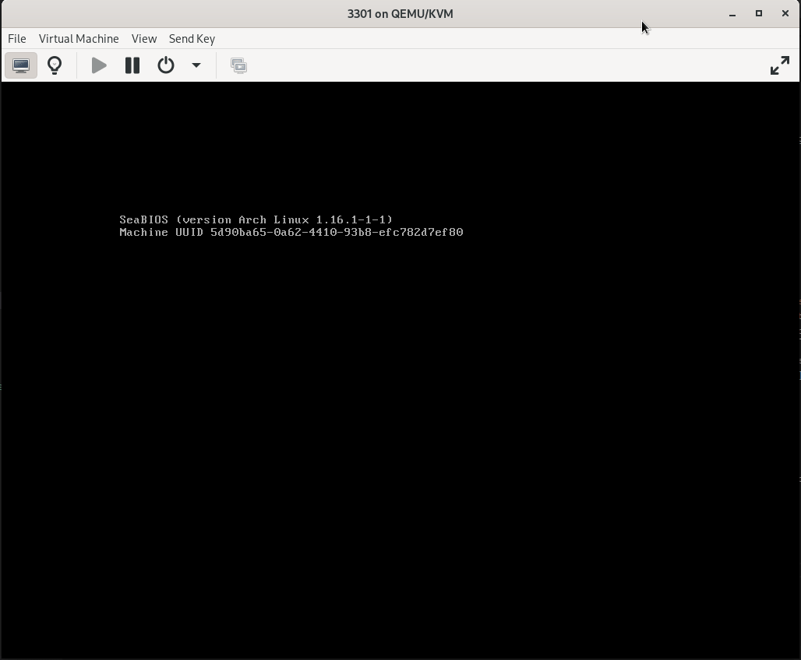

# 3301

The file [`from the book code Dropbox`](../001-232.jpg/README.md#solving-the-book-code) was an ISO disk image named 3301 with no extension.

Download it from [here](https://archive.org/download/https-www.dropbox.com-s-r7sgeb5dtmzj14s-3301/3301.iso), it is too large for GitHub's file
limits. You will need to place the `3301.iso` in this directory as `3301` and extract the image file per these steps. Both `3301` and `560.13`
are too large.

```bash
$ file 3301
3301: ISO 9660 CD-ROM filesystem data 'CDROM' (bootable)
```

## ISO contents

Just mounting the ISO presents you with several files even without the rootfs in a booted scenario.

```bash
$ mkdir /tmp/cdrom
$ sudo mount 3301 /tmp/cdrom/ && cd /tmp/cdrom
$ tree
.
├── audio
│   └── 761.mp3
├── boot
│   ├── 3301.img
│   ├── isolinux
│   │   ├── boot.cat
│   │   ├── isolinux.bin
│   │   ├── isolinux.cfg
│   │   ├── isolinux.txt
│   │   └── splash.rle
│   └── vmlinuz
└── data
    ├── _560.00
    ├── 560.13
    └── 560.17
```

### `audio/761.mp3` (The Instar Emergence)

<audio src="./3301-contents/audio/761.mp3" controls="controls">
Your browser does not support the audio element.
</audio>

**Metadata**

```
$ exiftool audio/761.mp3
ExifTool Version Number         : 12.50
File Name                       : 761.mp3
Directory                       : audio
File Size                       : 4.0 MB
File Modification Date/Time     : 2013:01:03 20:29:26-07:00 
File Access Date/Time           : 2022:12:03 23:01:05-07:00
File Inode Change Date/Time     : 2022:12:03 23:01:05-07:00
File Permissions                : -rw-r--r--
File Type                       : MP3
File Type Extension             : mp3
MIME Type                       : audio/mpeg
MPEG Audio Version              : 1
Audio Layer                     : 3
Audio Bitrate                   : 192 kbps
Sample Rate                     : 44100 
Channel Mode                    : Joint Stereo
MS Stereo                       : On
Intensity Stereo                : Off
Copyright Flag                  : False 
Original Media                  : True
Emphasis                        : None
Encoder                         : LAME3.98r
Lame VBR Quality                : 4
Lame Quality                    : 3
Lame Method                     : CBR
Lame Low Pass Filter            : 18.6 kHz
Lame Bitrate                    : 192 kbps
Lame Stereo Mode                : Joint Stereo
ID3 Size                        : 206
User Defined Text               : (Parable 1,595,277,641) Like the instar, tunneling to the surface\nWe must shed our own circumferences;\nFind the divinity within and emerge.
Title                           : The Instar Emergence
Artist                          : 3301
Duration                        : 0:02:47 (approx)
```

Of note, the interesting pieces here are:

|Attribute|Value|
|---|---|
|User Defined Text|(Parable 1,595,277,641) Like the instar, tunneling to the surface\nWe must shed our own circumferences;\nFind the divinity within and emerge.|
|Title|The Instar Emergence|
|Artist|3301|

Later, in the [twitter](../003-twitter/README.md#gematria) and [onion TCP server](../004-first-onion/README.md#tcp-server) puzzles `1,595,277,641` and the poem will be given meaning and become clearer. It is the product of the gematria value of the words.

### `data/`

Within the `data/` directory, there are three files. All three files are made use of later in the puzzle.

1. [Twitter XOR](../003-twitter/README.md#xor) puzzle.
2. [First onion XOR](../004-first-onion/README.md#solving).
3. [Third onion XOR](../006-third-onion/README.md#xor).

```
.
├── _560.00
├── 560.13
└── 560.17
```

All are random data - one mistakenly reports as an OpenPGP Secret Key.

```
$ file *
_560.00: data
560.13:  OpenPGP Secret Key
560.17:  data
```

### `boot/`

Within the boot directory, there was a modified SysLinux splash screen. I've taken the liberty of converting it for those that want neat wallpapers, etc. Nothing special about it - just raw pixel mappings.


```bash
$ lss16toppm < splash.lss > splash.ppm
$ convert splash.ppm splash.png
```

## Root FS

To pull out interesting files from the 3301.img, you'll need to `gunzip`, and extract the decompressed CPIO image with `binwalk`.

```bash
$ cp 3301.img 3301-decompressed.img.gz  # Required extension, filename too so original doesn't get overwritten
$ gunzip 3301-decompressed.img.gz       # Decompress
$ binwalk -eM 3301-decompressed.img     # Rip out CPIO contents
$ ls _3301-decompressed.img.extracted/
...
```

Within the rootfs, there are two directories of interest. They are `/tmp/` and `/usr/local/bin/`. Here are the only interesting files.

```bash
$ tree
.
├── tmp
│   ├── folly
│   └── wisdom
└── usr
    └── local
        └── bin
            ├── cicada
            ├── message.txt
            ├── message.txt.asc
            └── prime_echo
```

### `/tmp/`

Within `/tmp/` there are two files that are exactly the same named wisom and folly, they are random data with no known use.

```bash
$ file *
folly:  data
wisdom: data
```

### `/usr/local/bin/`

Within `/usr/local/bin/` there are three files. Two are shell scripts, the other is a message and its signed counterpart.

```bash
$ file *
cicada:          Neil Brown's ash script, ASCII text executable
message.txt:     ASCII text
message.txt.asc: PGP signed message
prime_echo:      Neil Brown's ash script, ASCII text executable
```

- **cicada** - clears the screan, executes the `prime_echo` script, clears once again, displays the `message.txt` for 10 seconds and reboots. It runs automatically on boot and will continue to unless you `CTRL+c` to escape to a shell. I've modified the `cicada` script to run on a bash shell in [cicada](./rootfs-modified/cicada) without rebooting.
- **prime_echo** - echos primes at .5 second intervals up to `3301`; on `1033` and `3301` the script sleeps for 2 seconds instead of .5. I've modified the `prime_echo` script to run on a bash shell in [prime_echo](./rootfs-modified/prime_echo).



## Inside the OS

None of this matters, but for those that are curious - the user account is tc (for tinycore), there is no password so `sudo -s` for the win. Nothing to pwn, although everything is so old you cold blow on it and get root. I've shown you everything the OS does in the above *fOrEnSiC aNaLySiS* so I'll just leave you with a GIF of the actual OS from boot to reboot.

I gave the machine garbage resources and am factoring large primes, excuse the mdevadm timeout.


