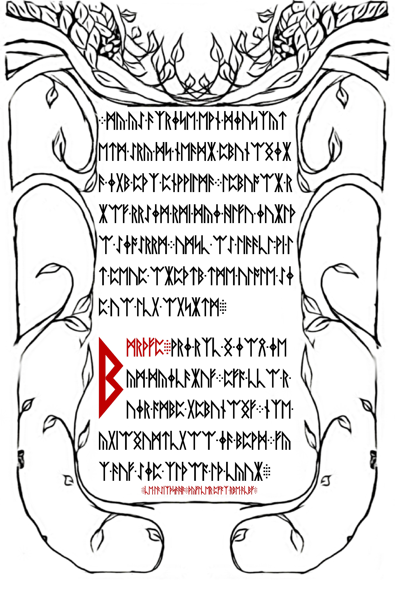

# fv7lyucmeozzd5j4.onion

After solving the first three pages, the [columnar transposition](../004-first-three-pages/README.md#pgp-message-from-xor-of-pgp-messages-in-3-first-pages) revealed this onion address.

## Hex/status page

Logs over time are unavailable, what we do have is the final string. It is a 512 character (256 byte) string that appears to still be a loose end. 

See [512.raw](512.raw)

```
<!--1033-->
87de5b7fa26ab85d2256c453e7f5bc3ac7f25ee743297817febd7741ededf07ca0c7e8b1788ea4131441a8f71c63943d8b56aea6a45159e2f59f9a194af23eaabf9de0f3123c041c882d5b7e03e17ac49be67cef29fbc7786e3bda321a176498835f6198ef22e81c30d44281cd217f7a46f58c84dd7b29b941403ecd75c0c735d20266121f875aa8dec28f32fc153b1393e143fc71616945eea3c10d6820bd631cf775cf3c1f27925b4a2da655f783f7616f3359b23cff6fb5cb69bcb745c55dff439f7eb6a4094bd302b65a84360a62f94c8b010250fcc431c190d6ed8cc8a3bfce37dddb24b93f502ad83c5fa21923189d8be7a6127c4105fcf0e5275286f2
```

After some time, the page updated to show `<!--3301-->` in place of `<!--1033-->` with a very long hex string. See [onion3.raw](./onion3.raw), and [server-status.raw](server-status.raw).

Status page leaks (showing the linode address  - see [here](ZRJhYgGP) and [here](je6Yudvh)) occurred. From [reports](5iRnfLkm) it sounds like the original status page was static and after it was found - it sounds like it tripped an update on the new status page. the The original HTML can be found [here](li676-224_server-status_new.txt) with the huge block of hex. This hex grew over time, [see hex-growth-over-time.json](hex-growth-over-time.json) for a list of JSON objects describing this growth (taken from numinit's GitHub).

The HTML for the completed status page is [here](./li676-224_server-status_new.html).

## Hex

See [decode.sh](decode.sh) for the full process. This is all the steps to extract all components from the hex on the onion/status page.

```bash
$ xxd -r -p onion3.hex > onion3.bin # convert <!--3301--> hex to data
$ ./reversebytes.py onion3.bin onion3-reversed.bin # reverse bytes for the reversed image on the end
$ cmp -l onion3.bin onion3-reversed.bin > onion3-cmp.txt # generate comparison of byte values and save it
$ dd if=onion3.bin bs=1 count=$(./findendofjpg.py onion3.bin) status=noxfer > 03.jpg # Extract ONLY the first image - no extra garbage
$ outguess -r 03.jpg 03.jpg.asc # get outguess message
$ gpg -d 03.jpg.asc | tail -n +6 | xxd -r -p > 03.jpg.asc.jpg # decrypt message, remove message from Cicada for hex, and convert to binary small image
$ xxd -r -p server-status.hex > server-status.bin # convert server status hex to data
$ ./reversebytes.py server-status.bin server-status-reversed.bin # reverse byte for reversed/appended image
$ cmp -l server-status.bin server-status-reversed.bin > server-status-cmp.txt # compare files byte-by-byte
$ dd if=server-status.bin bs=1 skip=$((0x00521e4)) count=357 status=noxfer | rev | xxd -p -r > square.txt # extract the magic square between mirrored images
$ dd if=server-status.bin bs=1 count=$(./findendofjpg.py server-status.bin) status=noxfer > 04.jpg # Extract ONLY the first image - no extra garbage
```

## Runes

There are two pages of runes to unfold and a small segment for the next onion.

### 03.jpg or "Welcome"


The runes are encrypted with a Vigenere cipher using and default ordering from the Gematria Primus discovered in 2013. The key is `DIUINTY` (divinity). Starting on the last `ᚠ` of the third line, the key resets its position to index 0, where it gets its original value of `F`, this continues throughout the rest of the page. 

A valid decrypt will look something like this, see [gematriaprimus.py](gematriaprimus.py).

```
WELCOME.WELCOME-PIL/
GRIM-TO-THE-GREAT-JOU/
RNEY-TOWARD-THE-END-OF-/
ALL-THNGS.IT-IS-NOT-AN-EASY-TRIP/
-BUT-FOR-THOSE-WHO-FIND-THEIR-WAY-/
HERE-IT-IS-A-NECESSARY-ONE.A/
LONG-THE-WAY-YOU-WILL-FIND-AN-EN/
D-TO-ALL-STRUGGLE-AND-SUFFE/
RNG-YOUR-INNOCENCE-YOUR-ILLU/
SIONS-YOUR-CERTAINTY-AND-YOU/
R-REALITY.ULTIMATELY-YOU-W/
ILL-DISCOUER-AN-END-TO-SELF/
```

The hex in the PGP message contained the following:


These runes are encrypted with a Vigenere using the key `WELHOMEPILGRIMTOTHE` (see [gematriaprimus.py](gematriaprimus.py) and [ga.py](ga.py)). The GA is used to evolve to a key that properly decrypt to the URL provided in the IRC conversation below (you'll never converge to a full .onion).

> <_BoB_> Using the key "welcome pilgrim to the" I decode the small rune picture as: A U O W Y F X L 5 L C S F J 3 N O N IO N
>
> \<dynomite27\> so... an hour ish ago from now. 

The correct result is `avowyfgl5lkzfj3n.onion`. Using his key, the `w` comes out to an `i` and `onion` never decrypts properly (ignore the `u` below, there is no `v` in the Gematria Primus, `u = v`). Below are the results of evolving the key with a genetic algorithm to attemp to obtain the proper key. We can see clearly that `WELHOME` is the propery start and that `onion` never converges.

The following results are in the format of `decrypt levenshtein distance from target:key:decrypt`

```
AUOWYFGL5LCSFJ3NONPN
AUOWYFGL5LKSFJ3NONPN
AUOWYFGL5LCZFJ3NONPN
AUOWYFGL5LKZFJ3NONPN
```

### 04.jpg or "Wisdom"/magic square



The runes are unencrypted using the ordering from the Gematria Primus discovered in 2013.

A valid decrypt will look something like this, see [gematriaprimus.py](gematriaprimus.py).

```
SOME-WISDOM.THE-PRIMES-ARE-SAC/
RED.THE-TOTIENT-FUNCTION-IS-SA/
CRED.ALL-THINGS-SHOULD-BE-ENCRY/
PTED./
&
CNOW-THIS./
272 138 SHADOWS 131 151/
AETHEREAL BUFFERS UOID CARNAL 18/
226 OBSCURA FORM 245 MOBIUS/
18 ANALOG UOID MOURNFUL AETHEREAL/
151 131 CABAL 138 272/
```

The data wedged between was the following ASCII - the same square with the words' values.

```
272     138     341     131     151
366     199     130     320     18
226     245     91      245     226
18      320     130     199     366
151     131     341     138     272
```