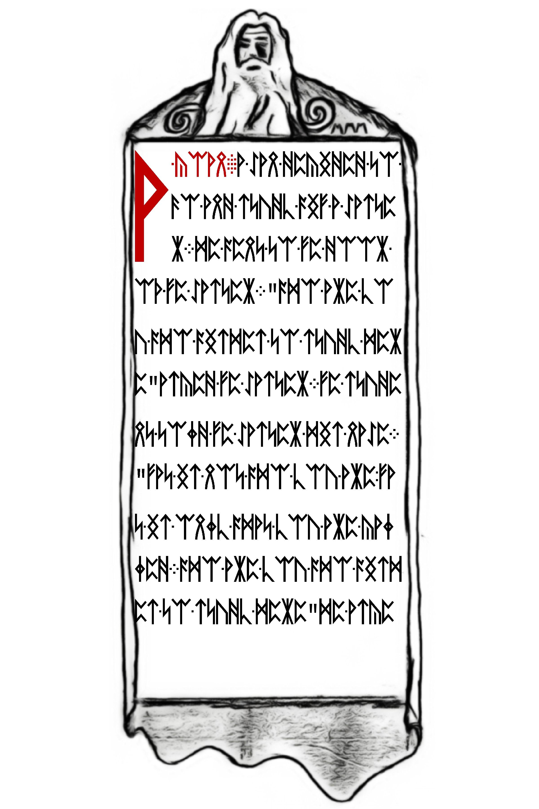

# auowyfgl5lkzfj3n.onion

After "solving" the [runes in the previous onion](../005-third-onion/README.md#runes) (more like `_BoB_` gave the answer quite suspiciously), solvers had the next URL. See [avowyfgl5lkzfj3n.html](./avowyfg151kzfj3n.html) for the page.

The site had a special header:

```
HTTP/1.0 200 (OK)
Cache-Control: max-age=0, no-cache
Connection: close
Date: Mon, 13 Jan 2014 05:39:41 GMT
Accept-Ranges: bytes
Server: Apache
Vary: Accept-Encoding
Content-Length: 615
Content-Type: text/html
X-Cicada: 3301
```

## Hex

The hex within the page is the same length as onion 2 and onion 3, 256 bytes (see [avowyfg151kzfj3n_256.hex](./avowyfg151kzfj3n_256.hex)). After a period of downtime, the server came back up with new hex (see [avowyfg151kzfj3n_update_after_downtime.html](./avowyfg151kzfj3n_update_after_downtime.html)). This hex a a gzip file. After gunzipping it contained 4 more images.

See [decode.sh](./decode.sh)

```
$ xxd -r -p avowyfg151kzfj3n_update_after_downtime.html > decoded.gz
$ gunzip -k decoded.gz
$ dd if=decoded bs=1 count=$(./findendofjpg.py decoded) status=noxfer > 06.jpg
$ dd if=decoded bs=1 skip=$(./findendofjpg.py decoded) status=noxfer > 06-trimmed.bin
$ dd if=06-trimmed.bin bs=1 count=$(./findendofjpg.py 06-trimmed.bin) > 07.jpg
$ dd if=06-trimmed.bin bs=1 skip=$(./findendofjpg.py 06-trimmed.bin) status=noxfer > "06,07-trimmed.bin"
$ ./reversebytes.py "06,07-trimmed.bin" "06,07-trimmed-reversed.bin"
$ dd if="06,07-trimmed-reversed.bin" bs=1 count=$(./findendofjpg.py "06,07-trimmed-reversed.bin") status=noxfer > 08.jpg
$ dd if="06,07-trimmed-reversed.bin" bs=1 skip=$(./findendofjpg.py "06,07-trimmed-reversed.bin") status=noxfer > "06,07,08-trimmed.bin"
$ dd if="06,07,08-trimmed.bin" bs=1 count=$(./findendofjpg.py "06,07,08-trimmed.bin") > 09.jpg
```

## Runes

All runes were encoded with a ROT cipher on the Gematria Primus lookup in atbash ordering. That is - the ordering of runes were reversed (atbash) and the index of the rune was shifted by 3.

### 06.jpg



```
A-COAN.A-MAN-DECIDED-TO-/
GO-AND-STUDY-WITH-A-MASTE/
R.HE-WENT-TO-THE-DOOR-/
OF-THE-MASTER.WHO-ARE-YO/
U-WHO-WISHES-TO-STUDY-HER/
E-ASCED-THE-MASTER.THE-STUDE/
NT-TOLD-THE-MASTER-HIS-NAME./
THAT-IS-NOT-WHO-YOU-ARE-THA/
T-IS-ONLY-WHAT-YOU-ARE-CAL/
LED.WHO-ARE-YOU-WHO-WISH/
ES-TO-STUDY-HERE-HE-ASCE/
```

With corrections:

```
A-KOAN.A-MAN-DECIDED-TO-/
GO-AND-STUDY-WITH-A-MASTE/
R.HE-WENT-TO-THE-DOOR-/
OF-THE-MASTER.WHO-ARE-YO/
U-WHO-WISHES-TO-STUDY-HER/
E-ASKED-THE-MASTER.THE-STUDE/
NT-TOLD-THE-MASTER-HIS-NAME./
THAT-IS-NOT-WHO-YOU-ARE-THA/
T-IS-ONLY-WHAT-YOU-ARE-CAL/
LED.WHO-ARE-YOU-WHO-WISH/
ES-TO-STUDY-HERE-HE-ASKE/
```

### 07.jpg


```
D-AGAIN.THE-MAN-THOUGHT-FOR-A-/
MOMENT-AND-REPLIED-I-AM-A-/
PROFESSOR.THAT-IS-WHAT-/
YOU-DO-NOT-WHO-YOU-ARE-/
REPLIED-THE-MASTER.WHO-AR/
E-YOU-WHO-WISHES-TO-STUD/
Y-HERE.CONFUSED-THE-MAN-TH/
OUGHT-SOME-MORE.FINALLY-/
HE-ANSWERED-I-AM-A-HUMAN-B/
ENG.THAT-IS-ONLY-YOUR-SPE/
CIES-NOT-WHO-YOU-ARE.WH/
```

### 08.jpg


```
O-ARE-YOU-WHO-WISHES-TO-/
STUDY-HERE-ASCED-THE-MASTE/
R-AGAIN.AFTER-A-MOMENT-OF-TH/
OUGHT-THE-PROFESSOR-REPL/
IED-I-AM-A-CONSCIOUSNESS-I/
NHABITNG-AN-ARBITRARY-BODY/
.THAT-IS-MERELY-WHAT-YOU-A/
RE-NOT-WHO-YOU-ARE.WHO-A/
RE-YOU-WHO-WISHES-TO-STU/
DY-HERE.THE-MAN-WAS-GETTNG-IR/
RITATED.I-AM-HE-STARTED-/
```

### 09.jpg


```
BUT-HE-COULD-NOT-THINC-OF-/
ANYTHNG-ELSE-TO-SAY-SO-HE-TRA/
ILED-OFF.AFTER-A-LONG-PAUSE-/
THE-MASTER-REPLIED-THEN-YO/
U-ARE-WELCOME-TO-COME-STU/
DY./

AN-INSTRUCTION.DO-FOUR-/
UNREASONABLE-THNGS-EACH-DA/
Y./
```


With corrections:

```
BUT-HE-COULD-NOT-THINK-OF-/
ANYTHNG-ELSE-TO-SAY-SO-HE-TRA/
ILED-OFF.AFTER-A-LONG-PAUSE-/
THE-MASTER-REPLIED-THEN-YO/
U-ARE-WELCOME-TO-COME-STU/
DY./

AN-INSTRUCTION.DO-FOUR-/
UNREASONABLE-THINGS-EACH-DA/
Y./
```

## Outguess

Only [08.jpg](08.jpg) had an outguess message, see [08.jpg.asc](08.jpg.asc). It is *NOT* signed - which is quite odd, especially after the URL for the fourth onion. It reads:

```

For those who have fallen behind:

TL BE IE OV UT HT RE ID TS EO ST PO SO YR 
SL BT II IY T4 DG UQ IM NU 44 2I 15 33 9M

Good luck.

3301


```

This is a columnar transposition cipher where the text needs to be arranged in rows of length 7. The column key (zero indexed) is `0,6,2,5,1,4,3`. The resulting message is:

`TOBELIEVETRUTHISTODESTROYPOSSIBILITYQ4UTGDI2N4M4UIM59133`

or 

``TO BELIEVE TRUTH IS TO DESTROY POSSIBILITY Q4UTGDI2N4M4UIM5 9133``

The 9133 is a loose end, experiments with port numbers on the onion resulted in very little and the token preceding it is the next onion URL.
