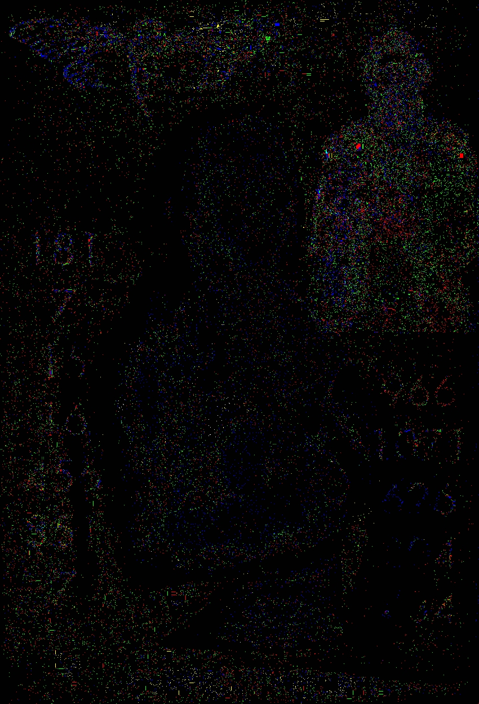

# q4utgdi2n4m4uim5.onion

After solving the [columnar transposition cipher](../006-fourth-onion/README.md#outguess) from the 4th onion, solvers were led to this onion. See [q4utgdi2n4m4uim5.html](q4utgdi2n4m4uim5.html). It had a valid signature from Cicada.

## Hex

The hex turned to binary results in an [MP3 file](./q4utgdi2n4m4uim5.html.mp3). Not much else can be done with this at the time being.

<audio src="./q4utgdi2n4m4uim5.html.mp3" controls="controls">
Your browser does not support the audio element.
</audio>

```
ExifTool Version Number         : 12.50
File Name                       : q4utgdi2n4m4uim5.html.mp3
Directory                       : .
File Size                       : 6.7 MB
File Modification Date/Time     : 2022:12:13 06:50:49-07:00
File Access Date/Time           : 2022:12:13 06:49:56-07:00
File Inode Change Date/Time     : 2022:12:13 06:59:08-07:00
File Permissions                : -rw-------
File Type                       : MP3
File Type Extension             : mp3
MIME Type                       : audio/mpeg
MPEG Audio Version              : 1
Audio Layer                     : 3
Audio Bitrate                   : 192 kbps
Sample Rate                     : 44100
Channel Mode                    : Joint Stereo
MS Stereo                       : On
Intensity Stereo                : Off
Copyright Flag                  : False
Original Media                  : True
Emphasis                        : None
ID3 Size                        : 54
Title                           : Interconnectedness
Artist                          : 3301
Duration                        : 0:04:37 (approx)
```

## Onion goes down and comes back up

Like the previous onion, there was downtime. When it came back there was a portrait in the HTML.


You can see the sillhouette of Rasputin in the right hand side. XORing the image with the original reveals numbers and a cicada logo as well.

