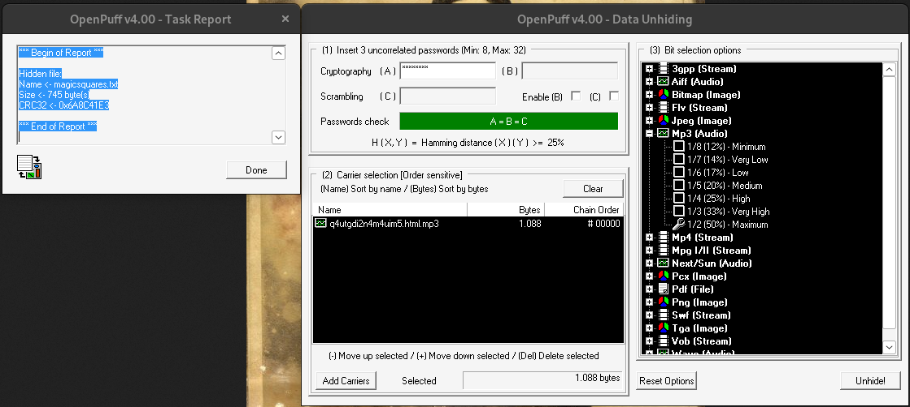
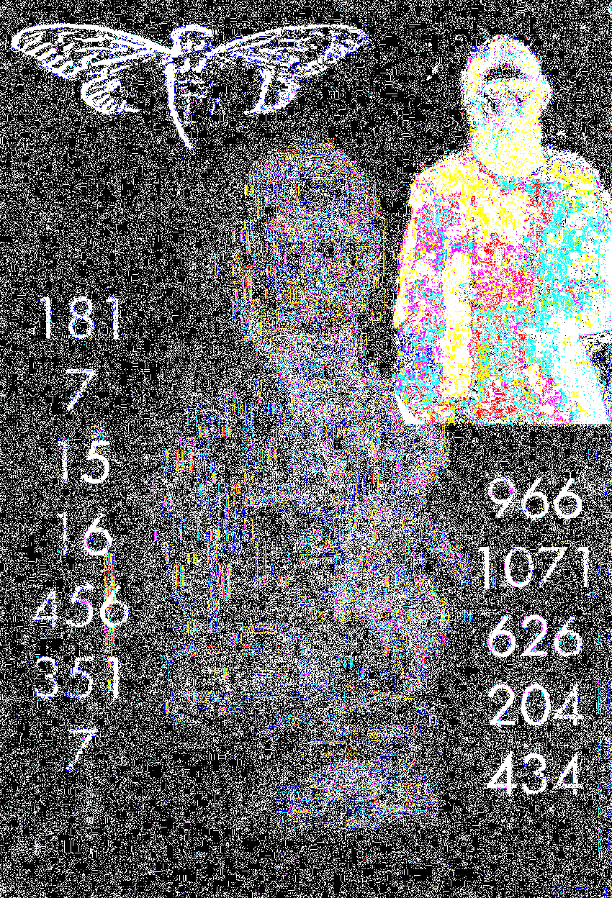

# q4utgdi2n4m4uim5.onion

After solving the [columnar transposition cipher](../006-fourth-onion/README.md#outguess) from the 4th onion, solvers were led to this onion. See [q4utgdi2n4m4uim5.html](q4utgdi2n4m4uim5.html). It had a valid signature from Cicada.

## Onion hex

The hex turned to binary results in an [MP3 file](./q4utgdi2n4m4uim5.html.mp3). Coloquially known as *Interconnectedness*.

<audio src="./q4utgdi2n4m4uim5.html.mp3" controls="controls">
Your browser does not support the audio element.
</audio>

```
ExifTool Version Number         : 12.50
File Name                       : q4utgdi2n4m4uim5.html.mp3
Directory                       : .
File Size                       : 6.7 MB
...
File Permissions                : -rw-------
File Type                       : MP3
File Type Extension             : mp3
MIME Type                       : audio/mpeg
MPEG Audio Version              : 1
Audio Layer                     : 3
Audio Bitrate                   : 192 kbps
Sample Rate                     : 44100
Channel Mode                    : Joint Stereo
MS Stereo                       : On
Intensity Stereo                : Off
Copyright Flag                  : False
Original Media                  : True
Emphasis                        : None
ID3 Size                        : 54
Title                           : Interconnectedness
Artist                          : 3301
Duration                        : 0:04:37 (approx)
```

## OpenPuff

Using a steganography tool called OpenPuff (v4.00 ONLY, v4.01 will not retrieve the file from the carrier) a file called magicsquares.txt falls out of the *Interconnectedness*. You can download OpenPuff v4.00 from [packetstormsecurity](https://packetstormsecurity.com/files/download/114680/OpenPuffv400.zip). The password is `33011033` with passwords `B` and `C` disabled. For bit selection options, set it to 50% (Maximum).



## magicsquares.txt

See [magicsquares.txt](magicsquares.txt).

```

434     1311    312     278     966
204     812     934     280     1071
626     620     809     620     626
1071    280     934     812     204
966     278     312     1311    434

7       375     236     190     27      17      181
351     223     14      47      293     98      7
456     232     121     114     72      23      15
16      65      270     331     270     65      16
15      23      72      114     121     232     456
7       98      293     47      14      223     351
181     17      27      190     236     375     7

272     138     341     131     151
366     199     130     320     18
226     245     91      245     226
18      320     130     199     366
151     131     341     138     272


```

## Portrait

Like the previous onion, there was downtime. When it came back there was a portrait in the HTML. It is of Andrés del Peral by Goya y Lucientes. Unknown significance at this time.


You can see the sillhouette of Rasputin in the right hand side. XORing or a modified NAND of the image with the original reveals numbers and a Cicada logo. See [logicgates.py](logicgates.py)

Modified NAND:



See also [xor.png](xor.png)

```
181   
7   
15   966
16  1071
456  626
351  204
7    434
```

Thes two columns sum to 1033 and 3301, likely hinting at the [OpenPuff password](#openpuff) for the [magicsquares.txt](#magicsquarestxt)

## Outguess

See [q4utgdi2n4m4uim5.onion.asc](q4utgdi2n4m4uim5.onion.asc)

```
-----BEGIN PGP SIGNED MESSAGE-----
Hash: SHA1

Very good.  You have done well to come this far.

--- 3 chunks of hex removed for brevity ---

3PI:6:1:3   
LML:1:1:1
3
ETOATS:19:9:1
...AF:5:3:1
AMO:13:10:1
CC:8:6:1
CBIA:3:7:2
CFAF:5:23:6
SPR:1:8:1
7
C[1]:4:5:3
AWDV:6:2:1
C[2]:2:17:5
SC:3:17:1
AOGS:2:8:1
ONION


Good luck.

3301


-----BEGIN PGP SIGNATURE-----
Version: GnuPG v1.4.11 (GNU/Linux)

iQIcBAEBAgAGBQJS23B2AAoJEBgfAeV6NQkPO88P/iFoOrLVCTo701fBGURyWQrQ
ctEaupFyWbGeujvC4WV7/HKUWsMPeSQnFA8lN+b5R35BF4Eq6vQXg4KHzL+u9eFt
BK3Q3ds4/qYjSzy+/xBIvweO0pQTPoT8k68rlVaUbMbECKKT2XYHdHhs4/8bnEBP
D3ycXUCmbmTH7cpWcghDGZqleHy8Bk+kTD1z48/UqjghXy/O3g41T6sE+Y0T08eF
x71qO980uG7UY3LHGLuY3pYBZT+Xn+cxci+RZNsdhZ5Ea0/GQkFLgbB4nXwQ/UaZ
5pihCjZa6MBB2s6O/oaTGinZmXXsF5Zn2EHze0OJ5/VOszrgYnt7Vdn4B4NQwcey
1hOkwmIlTW1JePnYGW7nIsPUMD4DZ7SSOkh3UX98Uf4nRh+DOyizHNJCmx3OSf1L
3cPDCZUHU8nMMpkWQ3Dda5kGERce+R7/wbhMimCW5xiwgNgyKVMCzr5gXmbe8RI2
tSd+LmYCU3TJZfbrGDJX/q5EICitr8K/VpbE2M1LktHSi2ggdDCWI1X3QJQL4ohx
errBxOYZYbG15HaCgJQNHfAyhFLbcC1ral8Pa6RxSa06+Jm3SDBc5CdmJzItXIyi
1RyuflGTZLECGSeYoG8F+bDjhr/wGcTXL5XVDJwmOfQtTHrqNjVV97w+3BfNKRR7
a6pDpW0gVPCMeycu+Ppd
=4lgN
-----END PGP SIGNATURE-----
```

## Outguess hex

After decoding the three chunks of hex, you are left with 3 files. Two JPEGs and an MP3. What's odd, is that these are some of the first pieces that do not have metadata scrubbed.

The equation in the first image is part of [Gödel's incompleteness theorems](https://en.wikipedia.org/wiki/G%C3%B6del%27s_incompleteness_theorems). It has a `Created with GIMP` EXIF data comment.


The picture of the eye is a painting by M.C. Escher called 'Eye', painted in 1946. The significance of this is unknown beyond him being a mathematically inspired artist. Look at his other works to see examples of this. Something of note, the exif data has the comment `LEAD Technologies Inc. V1.01`. The company appears to make expensive multimedia software amongst other things.


The mp3 file is a three second segment of Bach's Trio Sonata in G Major (BWV 1039).

<audio src="./03.mp3" controls="controls">
Your browser does not support the audio element.
</audio>

## Book code

Using the clues from the 3 files extracted in the [outguess hex](#outguess-hex), it directs us toward *Gödel, Escher, Bach: An Eternal Golden Braid* by Douglas Hofstadter. Using the book code in the [outguess](#outguess) data, we can solve for an onion URL where the format is `chapter:line:word:letter`