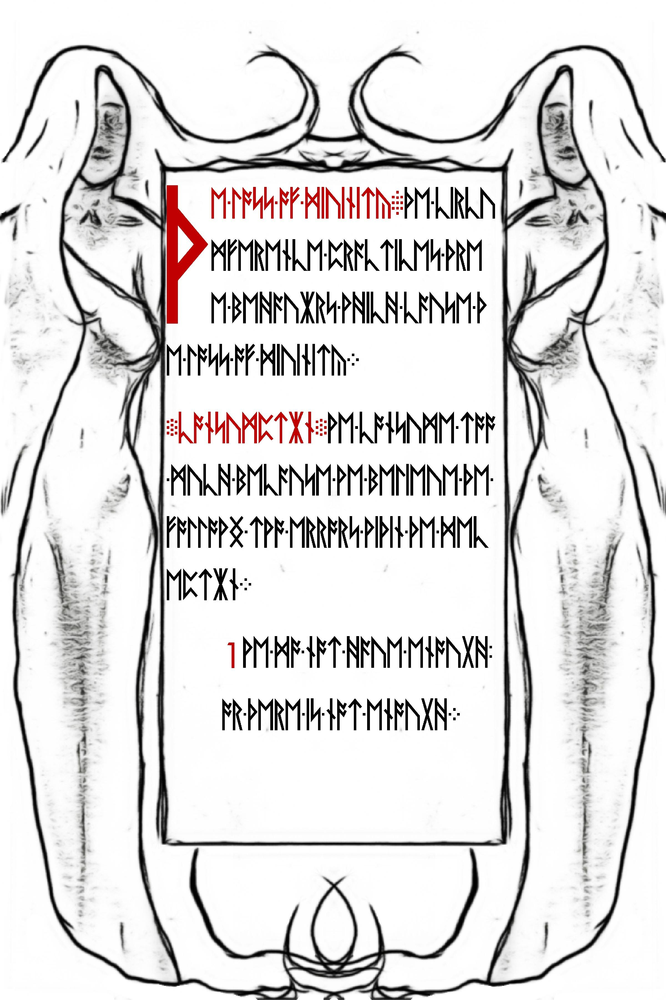
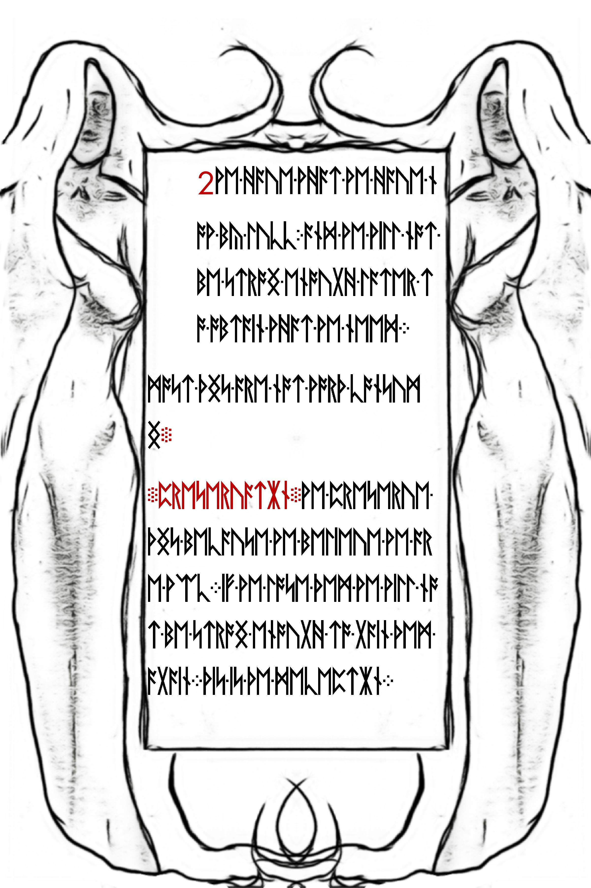

# ut3qtzbrvs7dtvzp.onion

After solving the [book code from the 5th onion](../007-fifth-onion/README.md#book-code), solvers navigated to this onion. It contained a numbered comment with hex as usual. See [ut3qtzbrvs7dtvzp.onion.html](./ut3qtzbrvs7dtvzp.onion.html).

Headers:

```
HTTP/1.0 200 (OK)
Cache-Control: max-age=0, no-cache
Connection: close
Date: Fri, 31 Jan 2014 06:57:04 GMT
Accept-Ranges: bytes
Server: Apache
Vary: Accept-Encoding
Content-Length: 8623291
Content-Type: text/plain
X-Cicada: 1033
```

## Hex

There was nothing special about the hex this time, the Liber Primus pages were in sequential order, no reversals, and no extra data.

See [decode.sh](decode.sh) and [findendofjpg.py](./findendofjpg.py)

```bash
$ xxd -r -p ./ut3qtzbrvs7dtvzp.hex > ./ut3qtzbrvs7dtvzp.bin
$ dd if=./ut3qtzbrvs7dtvzp.bin bs=1 count=$(./findendofjpg.py ./ut3qtzbrvs7dtvzp.bin) status=noxfer > 09.jpg
$ dd if=./ut3qtzbrvs7dtvzp.bin bs=1 skip=$(./findendofjpg.py ./ut3qtzbrvs7dtvzp.bin) status=noxfer > 09-trimmed.bin
$ dd if="09-trimmed.bin" bs=1 count=$(./findendofjpg.py 09-trimmed.bin) > 10.jpg
$ dd if="09-trimmed.bin" bs=1 skip=$(./findendofjpg.py 09-trimmed.bin) status=noxfer > "09,10-trimmed.bin"
$ dd if="09,10-trimmed.bin" bs=1 count=$(./findendofjpg.py "09,10-trimmed.bin") > 11.jpg
$ dd if="09,10-trimmed.bin" bs=1 skip=$(./findendofjpg.py "09,10-trimmed.bin") status=noxfer > "09,10,11-trimmed.bin"
$ dd if="09,10,11-trimmed.bin" bs=1 count=$(./findendofjpg.py "09,10,11-trimmed.bin") > 12.jpg
```

## Runes

All four new pages of Liber Primus are unencrypted. See [gematriaprimus.py](./gematriaprimus.py).


```
THE-LOSS-OF-DIUINITY.THE-CIRCU/
MFERENCE-PRACTICES-THRE/
E-BEHAUIORS-WHICH-CAUSE-TH/
E-LOSS-OF-DIUINITY./
CONSUMPTION.WE-CONSUME-TOO/
-MUCH-BECAUSE-WE-BELEIUE-THE-/
FOLLOWNG-TWO-ERRORS-WITHIN-THE-DEC/
EPTION./
1-WE-DO-NOT-HAUE-ENOUGH-/
OR-THERE-IS-NOT-ENOUGH./
```

With corrections:

```
THE-LOSS-OF-DIVINITY.THE-CIRCU/
MFERENCE-PRACTICES-THRE/
E-BEHAVIORS-WHICH-CAUSE-TH/
E-LOSS-OF-DIVINITY./
CONSUMPTION.WE-CONSUME-TOO/
-MUCH-BECAUSE-WE-BELEIUE-THE-/
FOLLOWNG-TWO-ERRORS-WITHIN-THE-DEC/
EPTION./
1-WE-DO-NOT-HAVE-ENOUGH-/
OR-THERE-IS-NOT-ENOUGH./
```



```
2-WE-HAUE-WHAT-WE-HAUE-N/
OW-BY-LUCC-AND-WE-WILL-NOT-/
BE-STRONG-ENOUGH-LATER-T/
O-OBTAIN-WHAT-WE-NEED./
MOST-THNGS-ARE-NOT-WORTH-CONSUM/
NG./
PRESERUATION.WE-PRESERUE-/
THNGS-BECAUSE-WE-BELIEUE-WE-AR/
E-WEAC.IF-WE-LOSE-THEM-WE-WILL-NO/
T-BE-STRONG-ENOUGH-TO-GAIN-THEM-/
AGAIN.THIS-IS-THE-DECEPTION./
```

With corrections:

```
2-WE-HAVE-WHAT-WE-HAVE-N/
OW-BY-LUCK-AND-WE-WILL-NOT-/
BE-STRONG-ENOUGH-LATER-T/
O-OBTAIN-WHAT-WE-NEED./
MOST-THNGS-ARE-NOT-WORTH-CONSUM/
NG./
PRESERVATION.WE-PRESERVE-/
THINGS-BECAUSE-WE-BELIEVE-WE-AR/
E-WEAK.IF-WE-LOSE-THEM-WE-WILL-NO/
T-BE-STRONG-ENOUGH-TO-GAIN-THEM-/
AGAIN.THIS-IS-THE-DECEPTION./
```



```
MOST-THNGS-ARE-NOT-WORTH-PRESERU/
NG./
ADHERENCE.WE-FOLLOW-DOGMA-/
SO-THAT-WE-CAN-BELONG-AND-BE-RIGH/
T-OR-WE-FOLLOW-REASON-SO-WE-CAN-/
BELONG-AND-BE-RIGHT./
THERE-IS-NOTHNG-TO-BE-RIGHT-ABOUT-/
TO-BELONG-IS-DEATH./
IT-IS-THE-BEHAUIORS-OF-CONSUMPT/
ION-PRESERUATION-AND-ADHEREN/
```

With corrections:

```
MOST-THINGS-ARE-NOT-WORTH-PRESERV/
NG./
ADHERENCE.WE-FOLLOW-DOGMA-/
SO-THAT-WE-CAN-BELONG-AND-BE-RIGH/
T-OR-WE-FOLLOW-REASON-SO-WE-CAN-/
BELONG-AND-BE-RIGHT./
THERE-IS-NOTHING-TO-BE-RIGHT-ABOUT-/
TO-BELONG-IS-DEATH./
IT-IS-THE-BEHAVIORS-OF-CONSUMPT/
ION-PRESERVATION-AND-ADHEREN/
```


```
CE-THAT-HAUE-US-LOSE-OUR-PRIMAL/
ITY-AND-THUS-OUR-DIUINITY./

SOME-WISDOM.AMASS-GREAT-W/
EALTH.NEUER-BECOME-ATTA/
CHED-TO-WHAT-YOU-OWN.BE-/
PREPARED-TO-DESTROY-ALL-THAT-/
YOU-OWN./

AN-INSTRUCTION.PROGRAM-YOU/
R-MIND.PROGRAM-REALITY./
```

With corrections:

```
CE-THAT-HAVE-US-LOSE-OUR-PRIMAL/
ITY-AND-THUS-OUR-DIVINITY./

SOME-WISDOM.AMASS-GREAT-W/
EALTH.NEVER-BECOME-ATTA/
CHED-TO-WHAT-YOU-OWN.BE-/
PREPARED-TO-DESTROY-ALL-THAT-/
YOU-OWN./

AN-INSTRUCTION.PROGRAM-YOU/
R-MIND.PROGRAM-REALITY./
```

## Outguess

There are 4 outguess messages within the new pages. The first two have the same frame for the squares. Below is all four messages. The frames are `3`, `3`, `0`, `1`. None of the squares are magic squares, so this is requesting three from past puzzles.

1. There are 3 in [magicsquares.txt](../007-fifth-onion/magicsquares.txt) (obtained through OpenPuff)
2. There is also [square.txt](../005-third-onion/square.txt) (data wedged between the pages in the third onion/same square from Liber Primus page with "void", etc. in it), it is the last square in the 3 from [magicsquares.txt](../007-fifth-onion/magicsquares.txt).

See [09.jpg.asc](./09.jpg.asc)

```
-----BEGIN PGP SIGNED MESSAGE-----
Hash: SHA1


Create one Tor hidden service that can accept CGI file uploads.

When this hidden service returns and can accept input, post the 
three magic squares and the URL to your Tor hidden service here.

Work alone.


3333333333333333
310    12    103
3              3
312    14    123
3              3
310    12    103
3333333333333333


Good luck.

3301


-----BEGIN PGP SIGNATURE-----
Version: GnuPG v1.4.11 (GNU/Linux)

iQIcBAEBAgAGBQJS24E0AAoJEBgfAeV6NQkPNPEP/jxtRsM2AOE3KRChpl1IHxGe
oMyd/YjXW7/o8X6Cv+AYhzQhRhqOQPL0N+fVC2WNO64CGnOmTLbhZPoXpV1giSmA
UguBIWZ59MmitGVmiz68M/i5H68h7s7eXoC5u7/iZjVMQBr86J1iJyeabVjJMSp+
OI8ouTuVAZ5lccvUy9UpV82GtGZoM7P1xxWJGpM3LIz6mv7VdfogrCNAW0jhZ2/x
8eiiHFuB5oktc9uTbIqhJQsESuc1u/uMkeb1OGXovKmD+zLtq+DPbWo8P0lnT70V
pyLOLM5CWsAjblU+5ohK57yFP6AV6x4l97BQyRmMOojh35QGKPVULZG4sRPKsuG5
nw93gRi6/eQ/aQvQuEvkf4lbj/V5G4kOj/YcQhyjAWdo1UPl9zkUXs2lKH7sUUms
P1WV6eyL6rAqpUXfwpDSfaPTPquIwuFsEl5z/d14IXnR3s+LQjlFDO3DE2d9QlEr
h5daiLFEvH+wyoJ5aPOsSkT+QJqCrVQNnbbQYzYKeMKAshu1LWuk1ZQ0XAEA6C2b
zbiPcXg0OMO+VWkhscZwxIHr1N5TVDj3NOszCfUe7lrYZhE0F/TL50NkGxw9+2qH
byDA8E4Yhe2c7pUVgs3OQLX46N4SOlbsH2MNXO9Y5jjI2Oj+OwLQ07F8jouNvXN4
kY3+nCV1PPLtiOu1CCP1
=/MnD
-----END PGP SIGNATURE-----
```

See [10.jpg.asc](./10.jpg.asc)

```
-----BEGIN PGP SIGNED MESSAGE-----
Hash: SHA1


Create one Tor hidden service that can accept CGI file uploads.

When this hidden service returns and can accept input, post the 
three magic squares and the URL to your Tor hidden service here.

Work alone.


3333333333333333
310    12    103
3              3
312    14    123
3              3
310    12    103
3333333333333333


Good luck.

3301


-----BEGIN PGP SIGNATURE-----
Version: GnuPG v1.4.11 (GNU/Linux)

iQIcBAEBAgAGBQJS24E+AAoJEBgfAeV6NQkPliIQAIKI2NrekF7zK5/2Fhao/9KB
hz5eIIfD/IJuz63NsxWrDa1sUOmXkGCcHLssX052Sves7q70XVv+qEK87Q2691Bj
fHCUvkc5doWqAmi4MRe4FnAdFjhugK7W1f+FP8+rY9275we571Ba+HbIsBTLYez7
AcLm3jGEnnFG16L6QSz+AOdZgWcoND6U3U8Hso+QUS/shDiq1Anc03V27p5IhxQr
DxEJoso0hozAMpKCJjFjC6CsciDuEO2zDZYrcoFCm5KhWbYyGh5fn7bWAjn/5qoI
fsQJdlctY3BLOQzkwVo+70bZYfjx3A/+zlx2+dW5VjKUOBqk5I85OYe/JNDvvzjv
nCpxUWoz7u3hzc/rkfNazWix2fqbbKp8CJAP6YwRuWOyMzo0TlLQ0ypxaAMj7R2P
Ekr4XG2mNdC694z+WVFiXNFMXaGdLzLqoO1ASJI+o5qqJ4FgmCrJwUA4LOlWAte5
wU45fXiHZ4pYWnlHg+9DbKGxt5whhNFHbWmH8X45PBsAcugkHXKg60AzEZZg0qte
+rFofXLxD3OVTdw+ho0Qu8EnHbbYa5dM+Iv0FXPfANwuQRKzJfMRWY+aBKcoZaub
jpvSti7zBE206L10Gy/ZkqYaOCCoAwO/9P15L0gRBGzSjWvNmNGMzxy+6541aCHu
JKQ6RQ9NbHJA6rxCX6UV
=XIyP
-----END PGP SIGNATURE-----
```

See [11.jpg.asc](./11.jpg.asc)

```
-----BEGIN PGP SIGNED MESSAGE-----
Hash: SHA1


Create one Tor hidden service that can accept CGI file uploads.

When this hidden service returns and can accept input, post the 
three magic squares and the URL to your Tor hidden service here.

Work alone.


0000000000000000
010    12    100
0              0
012    14    120
0              0
010    12    100
0000000000000000


Good luck.

3301


-----BEGIN PGP SIGNATURE-----
Version: GnuPG v1.4.11 (GNU/Linux)

iQIcBAEBAgAGBQJS24FGAAoJEBgfAeV6NQkPCrIP/2zWTFVu1kf311exrrc81Zml
Saxcj9fBew7J3ebDZVYzJ7rlctHWDmbn8QDhwbE7DuSMYfzZmxsw5AjGiyFNOq29
nZfu7y30TGNWk4n7/ORv5ONeeF/F2CfDvNNJ3ubNkoyBaojQuISFETOdrnsZNzn5
P7mkpSBRKuNQuydh7bucXVEmdtSRo+1591cMolQCsaD8SiOLUNzZnQIxAdugcNiH
WI71/dMQi1QW24POjYumjnuPQWuyIxRQgRJJvTJeuXsMAfz85uB5W6EU3bijO8Al
Xn8hTOQAXXVG6QtKt5NLUK8bafKr6UmUVcvltDZYmPW+3cnufvzcxU1Z5RgDOGAG
9FwtPYKveUXoIvRXTTjhSOl2YUlW8JItmqFWFSoph5D+9VZFYxL7P8BJat4r67B2
We0S7PApnJRFFYOpAfi7Pght1utsKMdHo3Hd8/LWuVzcRKE+Q+9CqYI8gPX0xj9d
vkKcxeK93rUY+Kv51M4P44cbyAPgTHBDf3amk3dAbKL2ajIu0/9xKDuqNh98mHyp
DQOvhokU6cqpi0AeQVnbzD4j9tr+6H5CoraefGah9hwt0smjdGBt5vHHZraygXVO
+/p579tDCQG66H7tva1ZHbgSOeiwKx+GUjeJKhl+gpt+MGR7z/Ke5wIpZf9B5ShK
wFBHJbC8oUgkS3JeJgE5
=UmhP
-----END PGP SIGNATURE-----
```

See [12.jpg.asc](./12.jpg.asc)

```
-----BEGIN PGP SIGNED MESSAGE-----
Hash: SHA1


Create one Tor hidden service that can accept CGI file uploads.

When this hidden service returns and can accept input, post the 
three magic squares and the URL to your Tor hidden service here.

Work alone.


1111111111111111
110    12    101
1              1
112    14    121
1              1
110    12    101
1111111111111111


Good luck.

3301


-----BEGIN PGP SIGNATURE-----
Version: GnuPG v1.4.11 (GNU/Linux)

iQIcBAEBAgAGBQJS24FNAAoJEBgfAeV6NQkPXw0P/14YlgeQO29u1L/ZJeIjNJ4V
YXtbqf4u2KVzVdL6nOhdlGaMNvQNTHzYSJxy+o1eeKRzrE9xFCmRaiN/gzUklyF0
WXG+SAUGedvFBkyvboEJ1MFf0cz5eUkrLPGM8wbJ2922mH4PpmmglLEkjewvNBQf
3xb+SEgZsAyA7OHkdKH69840JlJTHxNt7Ukjkt4tkDn72VN78Vj0ekPomu7rCGxW
l4ikFGqlHU10c797lEMwLUJ4tejEbYC0RIduvFyjwDf1hieYXm64UpxAi4HWvkgN
QIrZtZlr0KXKRECSmM9h6zVe/t0tSErNmYr6yeBDryDYb0m3ijVjwlscj2J1gOzm
13u1FWbdfuZgDoDC1ACEagoBLQjC6hjgnOab167Hxg681wvOOY+PslKlHsiueO6q
B/TzvSfI+eDFy/SQUo/WHeiRXxlrBxGjUBxytcy09fxEPQRzIqPeq7c7/bhbr/4b
/GHCIf0tgxc/SIeWK/0Rh88Egjfp6hX9R4LXf6JlL59RAf89s0aQiUxvkna+0hDY
NGqL1AgljncfzXrdGnoUlt4vYR8ubQBMxAy5BjPL4IPar6Oy9o0eZy0LdbMKbKln
3yUDQcoRQcI6Mki+amzgZtUw64mxMxiMWDx1EZhepsJt0y6DmKGONK5LcTGJ7HgI
a+QzPmj23nt6+gfPGD0C
=4CVy
-----END PGP SIGNATURE-----
```

## Hidden service returns

When the hidden service came back up, it had a signed message (see [ut3qtzbrvs7dtvzp.onion.v2-form.html](ut3qtzbrvs7dtvzp.onion.v2-form.html.asc)) detailing your CGI service implementation and forms for the upload. See [ut3qtzbrvs7dtvzp.onion.v2-form.html](ut3qtzbrvs7dtvzp.onion.v2-form.html) for the HTML.

```
-----BEGIN PGP SIGNED MESSAGE-----
Hash: SHA1


Hello.  You have done well to come this far.

Please paste the magic squares into the appropriate textareas below, then
provide the URL to your Tor hidden service.

The path to your CGI script which accepts uploads should be '/cgi-bin/upload'
and the HTML form input which accepts file uploads should be named 'file'.

Additionally, please generate a GnuPG key pair, and place the public key
in the location '/key.asc'.

We will contact you soon.

Good luck.

3301


-----BEGIN PGP SIGNATURE-----
Version: GnuPG v1.4.11 (GNU/Linux)

iQIcBAEBAgAGBQJS43VRAAoJEBgfAeV6NQkPVcQP/Rnli3AdTLAj28W1SMHTD6v0
Q67n89uGF6ZeD4U+dD2FHULAL9upNBRdzF7golqcfJCpeIKN0JYyilpGgSyTQmx+
yJXinlq4ZY+NNN45t8FtULvpVVO+L1ztF6dcohK+ZhAWWFj5u5WwEINx0mo+TE35
S7imfprBdk2C5B/E8ds7m35s74oWfdys8oY+vUHzOT4KB0SYFbankH6aLIe7fiTa
STB1Effelhg9F8YjDsopFHyF/kozI+eYk9yJcDEhlO4aiIkfZdNdLhXz80SIKw9v
ryjTCPUJfFrVpaelHxBefTOQHPfQEWnua7h6V6bx8Wiem7eiNyfXMAk1uoiu9zWW
FbA+MIFZ711kLvzD9Sg/0YGY97Gzzt0M1e8Pl/JYYzjOzFOH5pqmgMoOTBO0bvV+
d+QaLLiKmH0cYdTKmLv2xJ/1y7z0pakmgXCOhzIVQCDwoMxfGELLi9MNroaZFK3e
JzeDy828EfafrWpQ/LNzovb0XHyR1p4RRLq9vqMTFo0U0U7lLDKfWJvs4Y73o2Pn
QRNzn2+2GPQPj1CRMp5gxDFzwAMT0RBAfagkDiQu2uDxk8NZfSWkJVmsAUlLQLA9
7Wa5zuxPNvBf8Bws6y1C241FVfyttC4tNZEp2ShtbnHkZj1gFZf5v4rbq8wsxPrJ
Jp8kkuLi0PWCITmtfTsb
=TwC1
-----END PGP SIGNATURE-----
```

### Mock CGI service

See [cgi.py](./cgi/cgi.py) and [index.html](cgi/index.html) for completeness, this was never used in the real puzzle and is just my example. You'd have to set up the hidden service and configure Apache to use CGI, etc. The upload script would need to be at `/cgi-bin/upload` and your public key would need to be available at `/key.asc`.

### Submission

After successfully submitting the squares (Cicada wanted the specific squares, not a calculation of new squares) and your hidden service URL - you were greeted with this page [ut3qtzbrvs7dtvzp.onion.v2-submitted.html](ut3qtzbrvs7dtvzp.onion.v2-submitted.html) and three more pages of Liber Primus.


