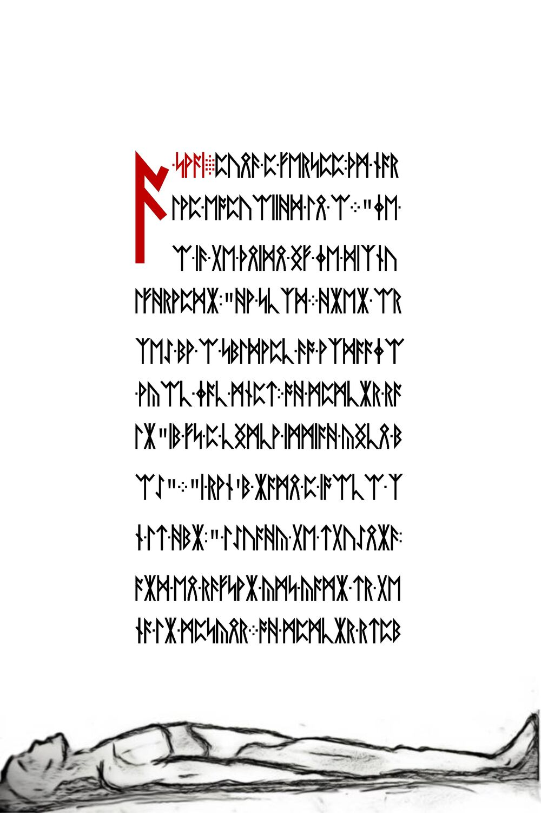

# Squares submission pages

After [submitting the squares and hidden service URL](../008-sixth-onion/README.md#submission), three more Liber Primus pages were given.

## Runes

The first two pages of runes are encrypted with the Vigenere key `FIRFUMFERENFE`. Like the "Warning" page, the key skips on some of the `ᚠ` runes and continues after it. The first two pages must be decrypted as one, the key continues onto the next page. The third page is unencrypted. See [gematriaprimus.py](gematriaprimus.py)




```
A-COAN.DURNG-A-LESSON-THE-MAS/
TER-EXPLAINED-THE-I.THE-/
I-IS-THE-UOICE-OF-THE-CIRCU/
MFERENCE-HE-SAID.WHEN-AS/
CED-BY-A-STUDENT-TO-EXPLAIN/
-WHAT-THAT-MEANT-THE-MASTER-SA/
ID-IT-IS-A-UOICE-INSIDE-YOUR-H/
EAD.I-DONT-HAUE-A-UOICE-I/
N-MY-HEAD-THOUGHT-THE-STUDENT-/
AND-HE-RAISED-HIS-HAND-TO-TE/
LL-THE-MASTER.THE-MASTER-STOP/
PED-THE-STUDENT-AND-SAID-THE-/
UOICE-THAT-JUST-SAID-YOU-HAU/
E-NO-UOICE-IN-YOUR-HEAD-IS-THE-/
I.AND-THE-STUDENTS-WERE-ENL/
IGHTENED./
```

With corrections:

```
A-KOAN.DURING-A-LESSON-THE-MAS/
TER-EXPLAINED-THE-I.THE-/
I-IS-THE-VOICE-OF-THE-CIRCU/
MFERENCE-HE-SAID.WHEN-AS/
KED-BY-A-STUDENT-TO-EXPLAIN/
-WHAT-THAT-MEANT-THE-MASTER-SA/
ID-IT-IS-A-VOICE-INSIDE-YOUR-H/
EAD.I-DONT-HAUE-A-VOICE-I/
N-MY-HEAD-THOUGHT-THE-STUDENT-/
AND-HE-RAISED-HIS-HAND-TO-TE/
LL-THE-MASTER.THE-MASTER-STOP/
PED-THE-STUDENT-AND-SAID-THE-/
VOICE-THAT-JUST-SAID-YOU-HAV/
E-NO-VOICE-IN-YOUR-HEAD-IS-THE-/
I.AND-THE-STUDENTS-WERE-ENL/
IGHTENED./
```

The third page is unencrypted.


```
AN-INSTRUCTION.CWESTION-ALL-/
THNGS.DISCOUER-TRUTH-INSIDE-/
YOURSELF.FOLLOW-YOUR-TRU/
TH.IMPOSE-NOTHNG-ON-OTHERS./
&
CNOW-THIS./
 434 1311 312  278  966
 204  812 934  280 1071
 626  620 809  620  626
1071  280 934  812  204
 966  278 312 1311  434
```

With corrections:

```
AN-INSTRUCTION.QUESTION-ALL-/
THINGS.DISCOVER-TRUTH-INSIDE-/
YOURSELF.FOLLOW-YOUR-TRU/
TH.IMPOSE-NOTHING-ON-OTHERS./
&
KNOW-THIS./
 434 1311 312  278  966
 204  812 934  280 1071
 626  620 809  620  626
1071  280 934  812  204
 966  278 312 1311  434
```