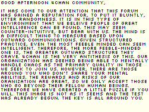
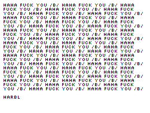

# 4chan post before Cicada

Some solvers believed this was Cicada related due to "THE KEY IS ALL AROUND YOU". It is not. Don't spin your gears, it's a huge troll and don't let anyone in IRC/Discord tell you differently.

[Original thread](http://web.archive.org/web/20240425200634/https://old.sage.moe/b/thread/16979236/)

## Image



## Solving

There is a RAR appended to the PNG that is password protected - the password is...

>! `/b/isfullofweeaboofaggotswhowillfallforanything`

This results in `the next step` which is also a PNG.

>! 

## Relevant web pages

- https://archive.4plebs.org/x/thread/16099725/
- https://archive.4plebs.org/x/thread/12461108/
- Russian wiki page: https://web.archive.org/web/20210421170912/https://mrakopedia.net/wiki/%D0%9E%D0%B1%D1%81%D1%83%D0%B6%D0%B4%D0%B5%D0%BD%D0%B8%D0%B5:%D0%A0%D0%BE%D0%BB%D0%B8%D0%BA,_%D0%BE%D1%82%D0%BA%D1%80%D1%8B%D0%B2%D0%B0%D1%8E%D1%89%D0%B8%D0%B9_%D1%81%D0%B2%D0%B5%D1%80%D1%85%D1%81%D0%BF%D0%BE%D1%81%D0%BE%D0%B1%D0%BD%D0%BE%D1%81%D1%82%D0%B8
- https://secretsofx.wordpress.com/2011/03/07/oldschool-jpgrar-puzzle/
- Russian forum where it was mentioned two weeks earlier, on April 9: https://web.archive.org/web/20130425134659/http://2ch.hk/sn/res/161855.html#161917
- Also a file was referred to, that was also uploaded on April 9: https://web.archive.org/web/20130517121757/http://rghost.ru/45151011

## Chat logs describing this

Scrubbed for brevity.

```
*
3301 is or was an actual organization existing years before the puzzles, however small they may have been at that time (or now)
but also, shit be hard
*
Yeah theres pretty clear evidence that they existed under the name 3301, theres a pre cicada puzzle also claiming it to be a recruiting tool that was found. It is from 2008 and uses some of the same phrasing as the cicada puzzles
*
it's signed 3301
and it is using the same methods and wording. The odds of a completely different group using the name 3301, using a puzzle for recruiting, and using the same wording is so over the top absurd.
*
oh and the file names use prime numbers.
*
Oh I never knew about one that is signed. I think *(?) shared one that wasn't signed but was still suspected to belong to them
*
either the post that it originated on or the data extracted says '3301' at the bottom. its not pgp signed.
*
Yeah the inclusion of “the key is all around you” is certainly conspicuous
*
then the 3301 mention is in the data within, i cant remember what step to be honest,
now i know when * sent it to me ateast, november 2019
*
and 2006 not 2008, sorry
*
It'll be inside the zlib
```
